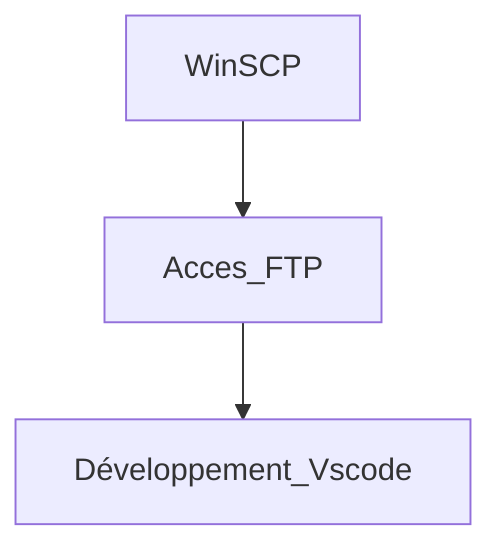

# Exercice 1

## Stage de BTS

J'ai effectué un stage dans la start up :  Le Dénicheur Auto Pro qui était en relation avec l'entreprise de développement de logiciel web Green Juice pour la création du logiciel web.

### Les silots
Il n'y a pas de silot dans l'entreprise Green Juice car l'équipe est composé de 5 membres qui sont dans le développement.

### Les pratiques dévops
Les pratiques dévops qui sont utilisé sont : 
 - Développement sur un serveur production ou le code est géré par GitLab pour la collaboration avec tous les membre et actualisé en temps réel.
 - Déploiement d'un logiciel web passant de serveur  mise a production  au serveur public.

### Outils utilisés
Travail en distanciel 

### Test
Il n'y avait pas de test pour les fonctionnalité nouvel ou modifié, mais avec l'utilisation d'un Framework maison sur PHP, la gestion des erreur était pris en compte rendant une page blanche si une erreur apparais.
